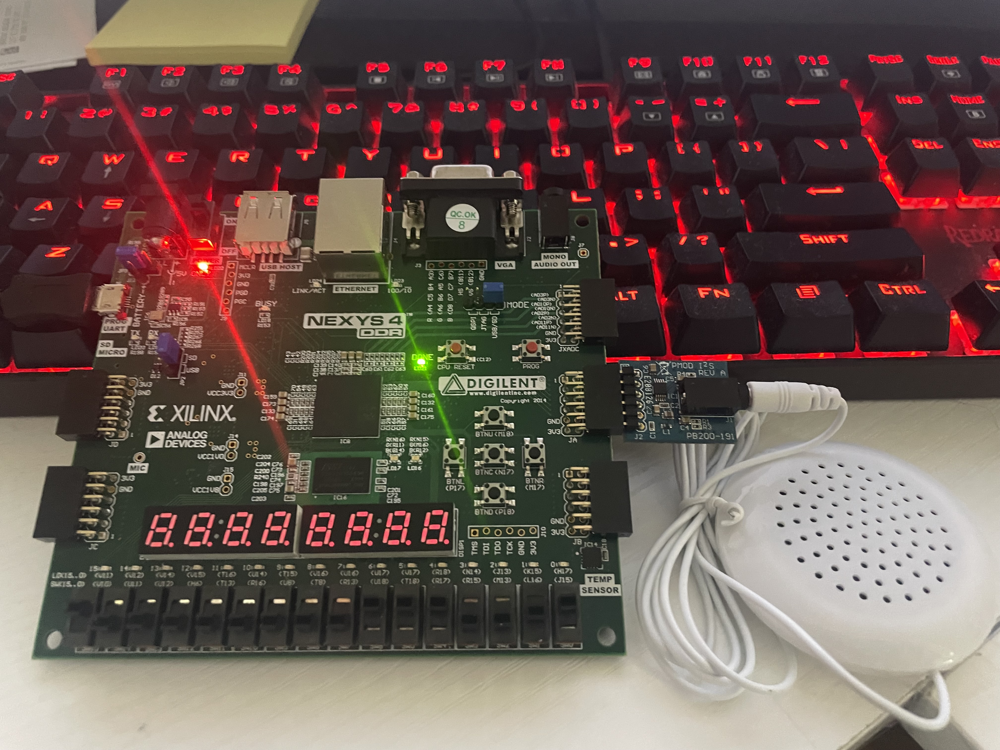

# Assignment 7: Vivado Lab 5

Open Vivado and create VHDL projects to synthesize, implement, generate bitstream, and program FPGA for
1. Lab 5: Digital-to-analog siren
2. Lab 5 modifications

Program Outcome 2: (*Design*)

2.2 The student will be able to build VHDL models of complex digital circuits suitable for synthesis where the target platform is an FPGA or ASIC logic library.

