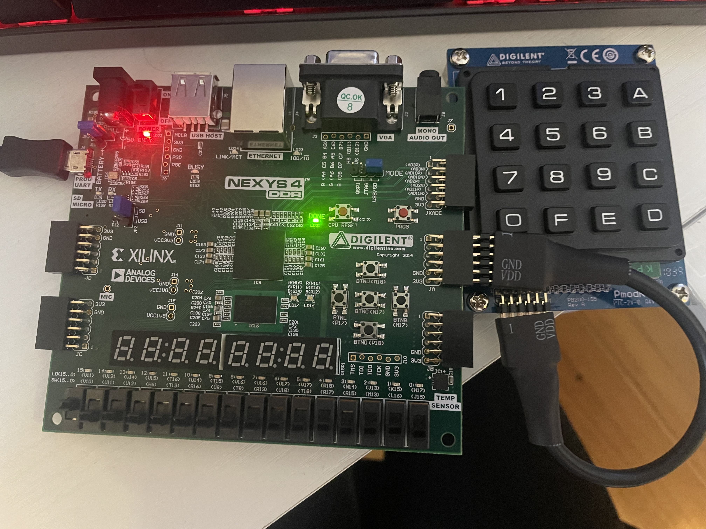

# Assignment 6: Vivado Lab 4

Open Vivado and create VHDL project to synthesize, implement, generate bitstream, and program FPGA for
1. Lab 4: Hex calculator
2. Lab 4 modifications

Program Outcome 2: (*Design*)

2.4 The student will be able to use VHDL to design complex synthesizable state machines using Mealy and/or Moore architectures.

