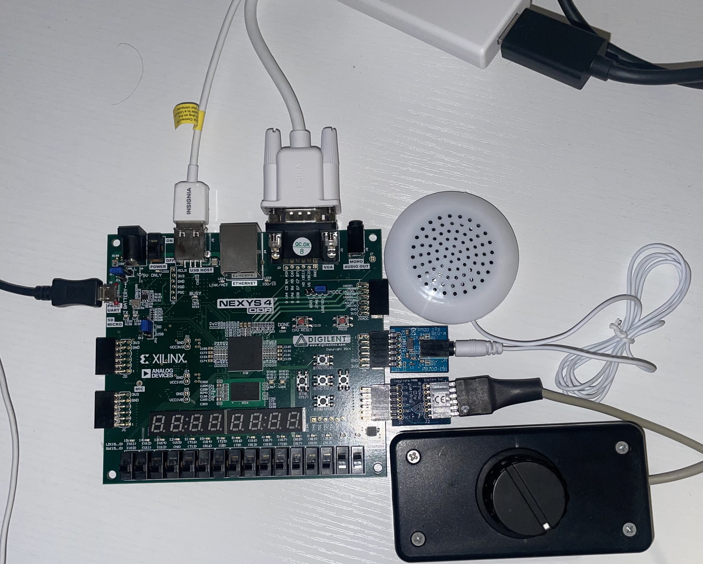
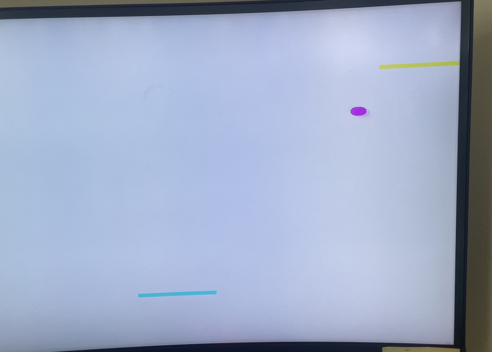

# Final Project - CPE-487-A

## Week 1

 
For this week I focused in gathering data and define the process for the next weeks. I wanted to review the VHDL material for the class, to familiarize myself with some lower level hardware programming skills

## Week 2

Focused in reviewing the pong implementation in [Lab 6](https://github.com/marcusats/CPE-487-A/tree/main/Assignment5_lab3%266/Lab6) and recognize improvement opportunities 

## Week 3

Enhanced the pong game to support another player and change colors. At this point I also work in adding sound every time the ball hits something. 
